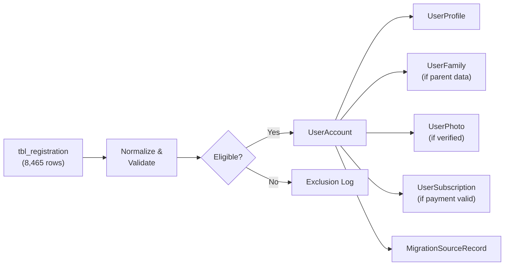

@" | Out-File -FilePath update_docs.ps1# Field Mapping — oldSoesyDB → kaliweb1_soesy2026

> **Status:** DRAFT — requires business approval  
> **Date:** 2026-09-04

## Legend

| Disposition | Meaning |
|---|---|
| `DIRECT` | Value can be copied directly (possibly with trim/case normalization) |
| `TRANSFORM` | Value requires computation, parsing, or format conversion |
| `MASTER LOOKUP` | Value must be resolved to a master-table ID via approved mapping |
| `GENERATE` | Value does not exist in old data and must be system-generated |
| `SKIP` | Old field has no target; value is not migrated |
| `REQUIRES REVIEW` | Cannot be safely automated; needs business decision |

---

## 1. UserAccount

| # | Old Column | Semantic Meaning | Target Column | Disposition | Conversion / Notes | Confidence |
|---|---|---|---|---|---|---|
| 1 | `reg_id` | Registration PK | — | `SKIP` (→ `MigrationSourceRecord.SourceRegistrationId`) | Not stored in `UserAccount`; tracked via separate migration-identity table | High |
| 2 | `m5` | Full name | `FullName` | `DIRECT` | `TRIM()`, collapse multiple spaces | High |
| 3 | `m6` | Mobile number | `MobileNumber` | `TRANSFORM` | Strip spaces/dashes/dots/plus. Validate 10-digit India format. 0 missing, duplicates check instead → `REQUIRES REVIEW` | Medium |
| 4 | `m22` | Email address | `Email` | `TRANSFORM` | `LOWER(TRIM())`. 279 rows fail format check → `REQUIRES REVIEW` | Medium |
| 5 | `ddl_2_id` | Looking-for / Gender | `GenderId` | `MASTER LOOKUP` | See Gender mapping in `MASTER_MAPPING.md`. ID `0` (72 rows) → `REQUIRES REVIEW` | Medium |
| 6 | — | Profile code | `ProfileCode` | `GENERATE` | Auto-generated by `usp_User_Register` or migration code using existing pattern (e.g. `SE` + sequence) | High |
| 7 | — | Password hash | `PasswordHash` | `GENERATE` | Set to sentinel `'MIGRATION_REQUIRES_RESET'`. Old DB has **no password for matrimonial rows**. Users must activate via reset flow | High |
| 8 | — | Active flag | `IsActive` | `GENERATE` | Default `1` for eligible rows | High |
| 9 | — | Premium flag | `IsPremium` | `GENERATE` | Default `0`; subscription handled separately | High |
| 10 | — | Membership plan | `MembershipPlanId` | `GENERATE` | Default `1` (Free plan) | High |
| 11 | — | Created timestamp | `CreatedAt` | `TRANSFORM` | Use old `regdate` if available and valid; otherwise migration timestamp | Medium |

---

## 2. UserProfile

| # | Old Column | Semantic Meaning | Target Column | Disposition | Conversion / Notes | Confidence |
|---|---|---|---|---|---|---|
| 1 | `m15` | Date of birth | `DateOfBirth` | `TRANSFORM` | Parse `dd/MM/yyyy` or `MM/dd/yyyy`. 27 missing, 39 unparseable, 5,092 ambiguous, 2590 MM/dd only (both formats yield different dates) → ambiguous = `REQUIRES REVIEW`, not guessed | Low |
| 2 | `m14` | Age | — | `SKIP` | Derivable from DOB; used only as cross-validation | — |
| 3 | `m11` | Height | `HeightId` | `MASTER LOOKUP` | Resolve cm value → `HeightMaster.HeightId`. 119 distinct height values mapped. Mixed units (cm, feet-like decimals, dates, phone numbers) → `REQUIRES REVIEW` for outliers | Low |
| 4 | `m10` | Weight | `Weight` | `TRANSFORM` | Parse as decimal kg. Non-numeric → `NULL` | Medium |
| 5 | `ddl_1_id` | Marital status | `MaritalStatusId` | `MASTER LOOKUP` | See Marital Status mapping in `MASTER_MAPPING.md`. ID `0` (86 rows) → `REQUIRES REVIEW`. Widow + Widower → `Widowed` | Medium |
| 6 | `m9` | Religion / Community (combined) | `ReligionId` | `MASTER LOOKUP` | Split combined string, match religion portion → `ReligionMaster.ReligionId`. Many misspellings (`HINDHU`, `Cristan`). See `MASTER_MAPPING.md` | Low |
| 7 | `m9` | Religion / Community (combined) | `CommunityId` | `MASTER LOOKUP` | Split combined string, match community portion → `CommunityMaster.CommunityId`. Requires `ReligionId` as parent context | Low |
| 8 | `m12` | Education | `EducationId` | `MASTER LOOKUP` | 1,093 distinct education values. Only exact/explicit alias matches automated. See `MASTER_MAPPING.md` | Low |
| 9 | `m13` | Occupation / Job | `OccupationId` | `MASTER LOOKUP` | 3,240 distinct occupation values. Only exact/explicit alias matches automated. See `MASTER_MAPPING.md` | Low |
| 10 | — | Company name | `CompanyName` | `SKIP` | Not present in old schema | — |
| 11 | — | Designation | `Designation` | `SKIP` | Not present in old schema | — |
| 12 | `m20` | Income | `IncomeId` | `MASTER LOOKUP` | Mostly `nil`/`nill`/missing. Mixes annual rupees, monthly values, lakhs, free text, family-class descriptions. See `MASTER_MAPPING.md` | Very Low |
| 13 | — | Country | `CountryId` | `GENERATE` | Default to India (`CountryId = 1` or equivalent) for all old rows | High |
| 14 | `m19` | District | `StateId` | `MASTER LOOKUP` | Old `m19` is labeled "District" but may need hierarchy lookup: `DistrictMaster` → `StateMaster` via FK. Duplicate district names under different states in target → match must include full hierarchy | Low |
| 15 | `m19` | District | `DistrictId` | `MASTER LOOKUP` | Resolve district name → `DistrictMaster.DistrictId` within the correct state context | Low |
| 16 | `m18` | Address | `Address` | `DIRECT` | `TRIM()`. Free-text field | High |
| 17 | — | Pincode | `Pincode` | `SKIP` | Not separately stored in old schema | — |
| 18 | `m21` | Description / About | `AboutMe` | `DIRECT` | `TRIM()` | High |
| 19 | — | Mother tongue | `MotherTongueId` | `SKIP` | Not present in old schema | — |

---

## 3. UserFamily

| # | Old Column | Semantic Meaning | Target Column | Disposition | Conversion / Notes | Confidence |
|---|---|---|---|---|---|---|
| 1 | `m16` | Father's name | `FatherName` | `DIRECT` | `TRIM()` | High |
| 2 | `m17` | Mother's name | `MotherName` | `DIRECT` | `TRIM()` | High |
| 3 | — | Father's occupation | `FatherOccupationId` | `SKIP` | Not present in old schema | — |
| 4 | — | Mother's occupation | `MotherOccupationId` | `SKIP` | Not present in old schema | — |
| 5 | — | Family type | `FamilyTypeId` | `SKIP` | Not present in old schema | — |
| 6 | — | Family status | `FamilyStatusId` | `SKIP` | Not present in old schema | — |
| 7 | — | Family value | `FamilyValueId` | `SKIP` | Not present in old schema | — |
| 8 | — | Native place | `NativePlace` | `SKIP` | Not present in old schema | — |
| 9 | — | Brothers | `Brothers` | `SKIP` | Not present in old schema | — |
| 10 | — | Married brothers | `MarriedBrothers` | `SKIP` | Not present in old schema | — |
| 11 | — | Sisters | `Sisters` | `SKIP` | Not present in old schema | — |
| 12 | — | Married sisters | `MarriedSisters` | `SKIP` | Not present in old schema | — |
| 13 | — | About family | `AboutFamily` | `SKIP` | Not present in old schema | — |

> **Note:** A `UserFamily` row is created only if `m16` (father) **or** `m17` (mother) has a non-empty value. If both are empty, the row is skipped.

---

## 4. UserPreference

| # | Old Column | Semantic Meaning | Target Column | Disposition | Notes |
|---|---|---|---|---|---|
| — | — | — | All fields | `SKIP` | Old schema contains **no structured preference data**. Missing concepts must remain null/empty rather than inferred from free text. A `UserPreference` row is **not created** during migration. |

---

## 5. UserPhoto

| # | Old Column | Semantic Meaning | Target Column | Disposition | Conversion / Notes | Confidence |
|---|---|---|---|---|---|---|
| 1 | `img1` | Photo 1 | `PhotoUrl` | `TRANSFORM` | Verify file exists at source URL. If accessible, copy to new FTP location → store new URL. `img1` treated as profile photo (`IsProfilePhoto = 1`) | Medium |
| 2 | `img2` | Photo 2 | `PhotoUrl` | `TRANSFORM` | Same as above, `IsProfilePhoto = 0`, `DisplayOrder = 2` | Medium |
| 3 | `img3` | Photo 3 / Jathakam? | `PhotoUrl` | `REQUIRES REVIEW` | Old field 25 is labeled "Jathakam" — `img3` may be a horoscope image, not a profile photo. Must be reviewed before migration | Low |
| 4 | `img4` | Photo 4 | `PhotoUrl` | `TRANSFORM` | Same as img2, `DisplayOrder = 4` | Medium |

> **42 rows** have no photo paths at all; **8,423 rows** have at least one.

---

## 6. UserSubscription

| # | Old Column | Semantic Meaning | Target Column | Disposition | Conversion / Notes | Confidence |
|---|---|---|---|---|---|---|
| 1 | `paystatus` | Payment flag | — | `TRANSFORM` | `paystatus = 1` for 8,464 rows, but most are unreliable | Very Low |
| 2 | `payamount` | Amount paid | `AmountPaid` | `TRANSFORM` | 1,601 non-decimal values, 597 zero amounts. Only valid decimal > 0 are eligible | Very Low |
| 3 | `transactionid` | Payment reference | `PaymentReference` | `TRANSFORM` | 1,003 duplicate groups covering 6,456 rows. Unique references only | Very Low |
| 4 | — | Plan | `MembershipPlanId` | `REQUIRES REVIEW` | No direct mapping from old payment data to new plan structure | Very Low |
| 5 | — | Start date | `StartDate` | `REQUIRES REVIEW` | Old DB has no subscription period concept | Very Low |
| 6 | — | End date | `EndDate` | `REQUIRES REVIEW` | Old DB has no subscription period concept | Very Low |
| 7 | — | Active flag | `IsActive` | `REQUIRES REVIEW` | Cannot determine active subscription vs historical payment | Very Low |
| 8 | — | Approved flag | `IsApproved` | `REQUIRES REVIEW` | No approval workflow in old system | Very Low |

> **Recommendation:** Subscription migration requires conservative eligibility rules: only rows with a valid decimal amount > 0, a unique transaction reference, and `paystatus = 1` should be considered. All others default to Free plan. Business must define plan mapping rules.

---

## 7. Fields Not Migrated (Old → No Target)

| Old Column | Semantic Meaning | Reason |
|---|---|---|
| `m7` | WhatsApp number | No target column; not stored in new schema |
| `m8` | Star / Nakshatra | No target column in new schema |
| `servicetype_id` | Service type | Used only for filtering (= 1 for matrimonial) |
| `ddl_2_id` raw | Looking-for direction | Consumed during gender derivation, raw ID not stored |
| `regdate` | Registration date | Used for `CreatedAt` derivation |
| `userstatus` | Old status flag | May inform profile status; needs review |

---

## 8. Data Flow Summary

